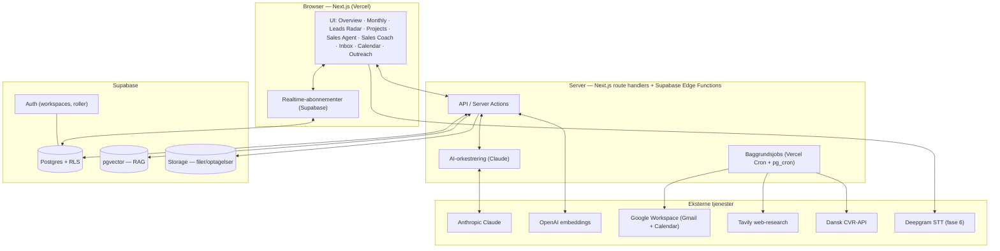
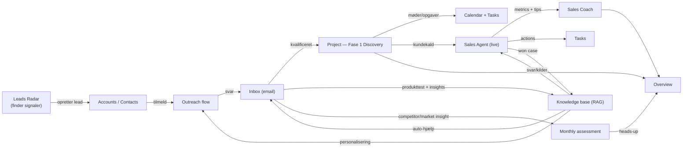
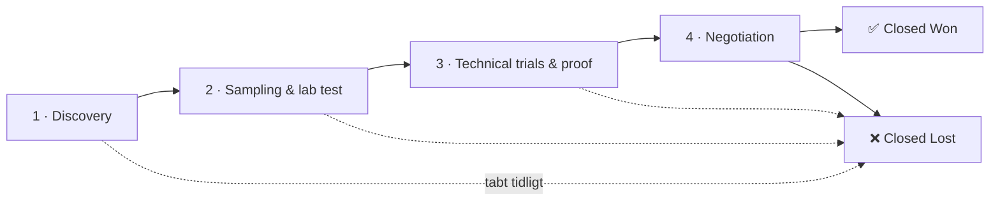
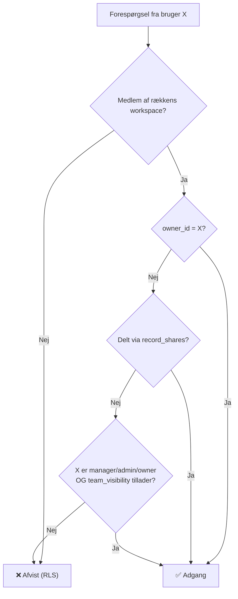

# 01 — Arkitektur & modul-sammenhæng

Dette dokument beskriver hele systemets opbygning: lagene, modulerne, hvordan data flyder mellem dem (flywheel'et), sikkerhedsmodellen, kunde-typologien og tech stack. Det er det mentale kort, Claude Code og du deler.

---

## 1. Lag-arkitektur (high level)



**Princip:** Frontend er "tynd" — al forretningslogik, AI-kald og datatilgang går gennem server-laget, så hemmelige nøgler (service role, OpenAI, Anthropic, Google) aldrig rammer browseren. RLS i Postgres er den sidste, ufravigelige sikkerhedsmur.

---

## 2. Modulerne og hvad de ejer

| Modul | Primære tabeller | Eksterne kald | Faser |
|---|---|---|---|
| Overview / Dashboard | læser på tværs (tasks, calendar_events, projects, lead_signals, intel_storylines) | — | Fase 2 |
| Monthly assessment | `intel_runs`, `intel_storylines`, `intel_competitors`, `intel_snapshots` | Tavily, Claude | **Fase 1** |
| Leads Radar | `lead_signals`, `accounts`, `contacts` | Tavily, CVR, Claude | Fase 4 |
| Projects | `projects`, `project_phase_events`, `project_artifacts`, `activities` | — | Fase 2 |
| Sales Agent | `calls`, `call_segments`, `call_retrievals`, `document_chunks` | Claude, OpenAI, (Deepgram) | Fase 3 / 6 |
| Sales Coach | `calls`, `coach_tips`, `coach_metrics_daily` | Claude | Fase 3 |
| Inbox | `emails`, `email_threads`, `email_accounts` | Google, OpenAI, Claude | Fase 5 |
| Calendar | `calendar_events` | Google | Fase 5 |
| Outreach flows | `outreach_flows`, `outreach_steps`, `outreach_enrollments`, `outreach_messages` | Google (send), Claude | Fase 4 |
| Knowledge base (RAG) | `documents`, `document_chunks` | OpenAI | Fase 3 |

---

## 3. Data-flywheel'et — hvorfor det hænger sammen

Kerneideen: **hver interaktion gør vidensbasen klogere, som gør alle moduler bedre.** Det er det, der adskiller appen fra et almindeligt CRM.



**Konkrete løkker:**

1. **Lead → kunde:** Radar finder et signal (fx "lancerer vegansk linje") → opretter `account` (lead) med fit-score + foreslået pitch → tilmeldes et `outreach_flow` → svar lander i `inbox` → ved kvalificering oprettes et `project` i Fase 1.
2. **Projekt-progression:** `project` rykker gennem de 4 faser; hver fase kræver artefakter (`project_artifacts`) som gate (se §5). Faseskift logges i `project_phase_events`.
3. **Kald → læring:** Sales Agent producerer `calls` + `call_segments` + live `call_retrievals`; Sales Coach beregner metrics og `coach_tips`; actions bliver til `tasks`; udfald opdaterer `project`; vundne sager bliver til `won_case`-dokumenter i RAG.
4. **Email som sensor:** Indgående mails analyseres → AI-resumé + udtrukne *insights*. Produkttest-resultater bliver `food_trial`-dokumenter i RAG; competitor/market-omtaler bliver intel-input. Udgående mails skrives med auto-hjælp fra RAG.
5. **Intelligence → handling:** Månedens storylines mappes til relevante `projects`/`accounts` og dukker op som heads-up på Overview ("Debut+Oterra berører din Arla-deal").

---

## 4. Kunde-typologi (accounts)

En `account` beskrives langs fire akser, så pipeline, pitch og territorier kan filtreres meningsfuldt:

- **`account_kind`** — virksomhedstype:
  - `distributor` (fx Brenntag, lokal distributør)
  - `ingredient_producer` (fx Oterra, Pigment, andre farve/ingrediens-producenter)
  - `brand_manufacturer` (food/beverage-brand der bruger farven direkte)
  - `other`
- **`maturity`** — modenhed/størrelse: `startup` · `local` · `regional` · `established` · `global`
- **`geo_scope`** — geografisk dækning: `single_country` · `multi_country_region` · `global`
- **`territory`** — konkret territorium (tekst-array), fx `["Mellemøsten"]`, `["Polen"]`, `["Global"]`, `["Norden","DACH"]`

**Eksempler modelleret:**

| Account | kind | maturity | geo_scope | territory |
|---|---|---|---|---|
| Brenntag (ME) | distributor | global | multi_country_region | Mellemøsten |
| Pigment (PL) | ingredient_producer | established | single_country | Polen |
| Oterra | ingredient_producer | global | global | Global |
| Lokal startup-distributør | distributor | startup | single_country | fx Danmark |

**Moder/datter & netværk:** `parent_account_id` peger på en moder-konto, så distributørnetværk og koncerner (fx Brenntag globalt → Brenntag ME) kan grupperes. Det gør det muligt at se pipeline både pr. enhed og pr. koncern.

Distributører kan desuden knyttes til de slut-applikationer/brands de dækker via `account` ↔ `account`-relationer (partner-links), men det er en udvidelse til efter Fase 4.

---

## 5. Projekt-faser (pipeline) og gates

De fire faser + afslutning, præcis som specificeret:



Hver fase har en **anbefalet gate** (artefakt der bør findes i `project_artifacts` før faseskift) — appen blokerer ikke, men markerer manglende gates:

| Fase | Enum | Typisk gate-artefakt (`project_artifacts.kind`) |
|---|---|---|
| 1 Discovery | `discovery` | `need_brief` (behov/applikation afdækket) |
| 2 Sampling & lab test | `sampling_lab` | `sample_sent` + `lab_result` |
| 3 Technical trials & proof | `technical_trials` | `trial_report` (proof of performance) |
| 4 Negotiation | `negotiation` | `quote` / `contract_draft` |
| Afslutning | status `won`/`lost` | `won_lost_reason` (påkrævet) |

Ved **Closed Won** oprettes automatisk et `won_case`-dokument i RAG (forslag til indhold genereres fra projektets aktiviteter), så vidensbasen vokser med hver vundet sag.

---

## 6. Sikkerhed & dataisolation (KRITISK)

Krav: **ingen bruger må se en andens data.** Det håndhæves i tre lag, hvor Postgres RLS er den ufravigelige bund.

### 6.1 To isolationsniveauer

1. **Workspace-isolation (tenant):** Alle forretningstabeller har `workspace_id`. En bruger kan kun røre rækker i workspaces, hvor de er medlem (`workspace_members`). Dette adskiller firmaer fra hinanden i multi-tenant.
2. **Rækkeniveau-isolation (per bruger):** *Inden for* et workspace ser en sælger som udgangspunkt **kun sine egne rækker** (`owner_id = auth.uid()`), plus rækker eksplicit delt med dem.

### 6.2 Roller (`workspace_members.role`)

- `rep` — ser kun egne konti, projekter, opgaver, kald; og **altid kun egne** emails/kald.
- `manager` — kan se teamets konti/projekter/opgaver/coach-metrics (styres af `team_visibility`-flag), men **ikke** andres emails som standard.
- `admin` — workspace-administration + alt forretningsdata (ikke privat email).
- `owner` — som admin + fakturering/sletning.

### 6.3 Synlighedsmodel



- **`record_shares`**-tabel giver eksplicit, granulær deling (fx del ét projekt med en kollega) uden at åbne alt.
- **Private tabeller (altid kun ejer):** `emails`, `email_threads`, `email_accounts`, `calls`, `call_segments`, `call_retrievals`, `coach_tips`. Disse er aldrig synlige for andre — heller ikke managers — medmindre eksplicit delt. Begrundelse: personlig kommunikation og samtale-coaching er privat.
- **Service-role-jobs** (cron/ingestion) kører uden om RLS men sætter altid korrekt `workspace_id`/`owner_id` på det de skriver.

### 6.4 Øvrige sikkerhedsforanstaltninger

- **OAuth-tokens** (Google) gemmes krypteret i Supabase Vault — aldrig i klar-tekst i en tabel, aldrig i frontend.
- **Hemmelige nøgler** (service role, OpenAI, Anthropic, Tavily) kun i server-miljøvariabler.
- **Audit-log** (`audit_log`) på følsomme handlinger (deling, sletning, eksport, rolle-ændring).
- **PII-disciplin:** kontaktdata minimeres; eksport logges.
- RLS aktiveres på **alle** forretningstabeller — testes eksplicit i Fase 2's acceptkriterier med to testbrugere.

Den konkrete RLS-implementering (helper-funktioner `is_workspace_member`, `can_read_record`, samt politikker pr. tabel) ligger i `03_SUPABASE_SCHEMA.sql`.

---

## 7. RAG-arkitektur (kort — fuld byggevejledning i køreplanen)

- **Indlæsning:** dokument → chunking (~500 tokens, overlap) → OpenAI `text-embedding-3-small` (1536 dim) → `document_chunks` med `route` (technical/commercial) + `workspace_id`.
- **Opslag:** forespørgsel → embedding → `match_chunks(workspace_id, route, k)` (HNSW cosine) → top-k chunks → Claude formulerer svar med kilder.
- **Routing:** hurtig klassifikation (teknisk vs. commercial) før opslag — billigt Claude-kald der returnerer ét ord.
- **Latenstid:** vektor-opslag <100 ms; svaret streames, kilder vises straks. Region: Supabase i Frankfurt (eu-central-1).
- **Isolation:** RAG-opslag filtreres altid på `workspace_id` — ét firmas viden lækker aldrig til et andet.

---

## 8. Baggrundsjobs

| Job | Kadence | Motor | Hvad |
|---|---|---|---|
| Månedlig intelligence-scan | 1. hverdag i måneden | Vercel Cron → Edge Function | Tavily-scan + Claude-syntese + delta vs. forrige snapshot |
| Leads Radar-scan | dagligt | Vercel Cron | Find nye signaler, CVR-berig, fit-score |
| Outreach scheduler | hvert 15. min | pg_cron / Vercel Cron | Send forfaldne outreach-trin |
| Gmail/Calendar sync | hvert 5.–10. min | Edge Function (Google push + polling) | Hent nye mails/events, AI-resumé, insight-udtræk |
| Embeddings-kø | løbende | Edge Function | Indekser nye dokumenter |
| Coach-rollups | natligt | pg_cron | Genberegn `coach_metrics_daily` |

---

## 9. Miljøvariabler (samlet)

```
# Supabase
NEXT_PUBLIC_SUPABASE_URL=
NEXT_PUBLIC_SUPABASE_ANON_KEY=
SUPABASE_SERVICE_ROLE_KEY=
# AI
ANTHROPIC_API_KEY=
OPENAI_API_KEY=
# Research / berigelse
TAVILY_API_KEY=
CVR_API_BASE=https://cvrapi.dk/api      # dansk CVR-opslag
# Google Workspace (OAuth)
GOOGLE_CLIENT_ID=
GOOGLE_CLIENT_SECRET=
GOOGLE_OAUTH_REDIRECT_URL=
# Tale-til-tekst (fase 6)
DEEPGRAM_API_KEY=
# App
APP_BASE_URL=
```

Samme nøgler lægges i Vercel → Project → Settings → Environment Variables. `.env.local` kommer aldrig i Git.
