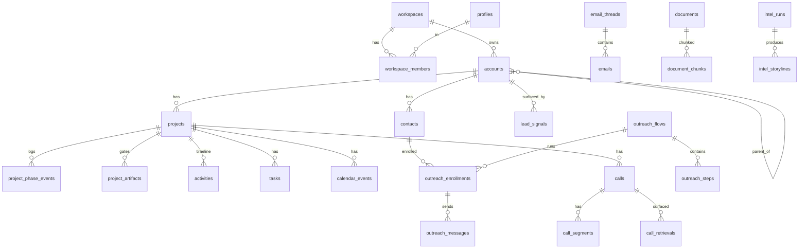

# 02 — Datamodel

Læsbar oversigt over alle tabeller, enums og relationer. Den kørbare SQL ligger i `03_SUPABASE_SCHEMA.sql` og følger denne model 1:1.

**Fælles konventioner for alle forretningstabeller:**
- `id uuid primary key default gen_random_uuid()`
- `workspace_id uuid not null references workspaces(id)` (tenant-isolation)
- `owner_id uuid references profiles(id)` (rækkeniveau-isolation, hvor relevant)
- `created_at timestamptz default now()`, `updated_at timestamptz`
- RLS aktiveret (se sikkerhedsafsnit i dok. 01 + politikker i SQL).

---

## ER-overblik (kerne)



---

## A. Tenancy & identitet

### `workspaces`
Firma/tenant. `id, name, slug (unik), plan (text), settings jsonb, created_at`.

### `profiles`
1:1 med `auth.users`. `id (=auth uid), full_name, avatar_url, title, phone, default_workspace_id, created_at`.

### `workspace_members`
Medlemskab + rolle (grundlag for RLS). `id, workspace_id, user_id→profiles, role (enum workspace_role), team_visibility bool default false, created_at`. Unik på (`workspace_id`,`user_id`).

### `record_shares`
Eksplicit deling af én række med én bruger. `id, workspace_id, entity (text: 'project'|'account'|...), entity_id uuid, shared_with→profiles, permission (text: 'read'|'write'), shared_by, created_at`.

---

## B. CRM: konti, kontakter, projekter

### `accounts`
Kunde/lead/distributør/producent.
`id, workspace_id, owner_id, name, account_kind (enum), maturity (enum), geo_scope (enum), territory text[], type (enum account_type: lead/prospect/customer/partner/competitor), status (enum account_status), parent_account_id→accounts, cvr text, reg_no text, country text, sector_nace text, website text, description text, fit_score int, source text, enrichment jsonb, created_at, updated_at`.

### `contacts`
`id, workspace_id, owner_id, account_id→accounts, full_name, title, email, phone, linkedin_url, is_primary bool, notes, created_at, updated_at`.

### `projects`
Deal/sag i pipeline.
`id, workspace_id, owner_id, account_id→accounts, name, application text (fx "funktionel sportsdrik"), product text default 'Natu.Red®', phase (enum project_phase), status (enum project_status), value_eur numeric, currency text default 'EUR', probability int, pitch_angle text, expected_close_date date, won_lost_reason text, closed_at timestamptz, created_at, updated_at`.

### `project_phase_events`
Faseskift-historik. `id, workspace_id, project_id, from_phase, to_phase, changed_by→profiles, note, created_at`.

### `project_artifacts`
Gate-artefakter pr. fase. `id, workspace_id, project_id, phase (enum project_phase), kind (text: need_brief/sample_sent/lab_result/trial_report/quote/contract_draft/...), document_id→documents (nullable), status (text: pending/complete), created_at`.

### `activities`
Samlet tidslinje (note/kald/email/møde/system). `id, workspace_id, owner_id, project_id, account_id, contact_id, type (enum activity_type), title, body, occurred_at, metadata jsonb, created_at`.

---

## C. Opgaver & kalender

### `tasks`
`id, workspace_id, owner_id (assignee), title, description, project_id, account_id, contact_id, due_date date, priority (enum task_priority), status (enum task_status), source (text: manual/agent/flow), created_by, created_at, updated_at`.

### `calendar_events`
`id, workspace_id, owner_id, external_id text (Google event id), provider text default 'google', project_id, account_id, title, description, location, start_at timestamptz, end_at timestamptz, attendees jsonb, meeting_type text, created_at, updated_at`. Unik på (`provider`,`external_id`,`owner_id`).

---

## D. Inbox (email) — PRIVAT (kun ejer)

### `email_accounts`
Forbundet Gmail-konto pr. bruger. `id, workspace_id, user_id→profiles, provider text default 'google', email_address, history_id text, status text, vault_secret_id uuid (peger på krypteret token i Supabase Vault), created_at`.

### `email_threads`
`id, workspace_id, owner_id, account_id, project_id, subject, participants jsonb, last_message_at, created_at`.

### `emails`
`id, workspace_id, owner_id, thread_id→email_threads, external_id, direction (enum email_direction), from_addr, to_addrs text[], cc text[], subject, snippet, body_text, body_html, sent_at timestamptz, contact_id, account_id, project_id, ai_summary text, extracted jsonb (insights/test_results/competitor_mentions), embedding vector(1536), created_at`. Unik på (`owner_id`,`external_id`).

> RLS: alle email-tabeller er strikt `owner_id = auth.uid()` (ingen leder-override).

---

## E. Outreach flows (automatisering)

### `outreach_flows`
`id, workspace_id, owner_id, name, description, trigger_type (enum: manual/lead_created/phase_change/no_reply/signal), trigger_config jsonb, status (enum flow_status), created_at, updated_at`.

### `outreach_steps`
`id, workspace_id, flow_id→outreach_flows, step_no int, channel (text: email/task/wait), delay_hours int, template_subject, template_body, ai_personalize bool default true, conditions jsonb, created_at`.

### `outreach_enrollments`
`id, workspace_id, owner_id, flow_id, account_id, contact_id, project_id, current_step int default 0, status (enum enrollment_status), next_action_at timestamptz, enrolled_by, created_at, updated_at`.

### `outreach_messages`
`id, workspace_id, enrollment_id→outreach_enrollments, step_id→outreach_steps, email_id→emails (nullable), status (text: scheduled/sent/skipped/replied/failed), scheduled_at, sent_at, created_at`.

---

## F. Knowledge base (RAG)

### `documents`
`id, workspace_id, owner_id, title, doc_type (enum), route (enum rag_route), source text, raw_text text, file_url text, account_id, project_id, metadata jsonb, status (text: pending/indexed/failed), created_by, created_at, updated_at`.

### `document_chunks`
`id, workspace_id, document_id→documents, chunk_no int, content text, route (enum rag_route), embedding vector(1536), metadata jsonb, created_at`. HNSW-indeks på `embedding` (cosine).

---

## G. Sales Agent & Sales Coach — PRIVAT (kun ejer)

### `calls`
`id, workspace_id, owner_id, project_id, account_id, started_at, ended_at, duration_sec int, channel text, recording_url, transcript_url, talk_ratio numeric, questions_count int, objection_handle_rate numeric, longest_monologue_sec int, next_step_set bool, sentiment numeric, coach_score int, summary text, created_at`.

### `call_segments`
`id, workspace_id, call_id→calls, speaker (text: rep/customer), ts_start int, ts_end int, text, intent (text: question/objection/statement), route (enum rag_route nullable), created_at`.

### `call_retrievals`
Hvad agenten hentede live. `id, workspace_id, call_id, segment_id→call_segments, route, query, chunk_ids jsonb, latency_ms int, answer text, created_at`.

### `coach_tips`
`id, workspace_id, owner_id, call_id, category text, tip text, created_at`.

### `coach_metrics_daily`
Rollups pr. bruger/dag. `id, workspace_id, owner_id, date, calls_count int, avg_talk_ratio numeric, avg_questions numeric, avg_objection_rate numeric, avg_coach_score numeric, next_step_rate numeric`.

---

## H. Market Intelligence (Monthly assessment)

### `intel_runs`
`id, workspace_id, period_month date (1. i måneden), run_at, status (text), net_position text, summary text, model text, created_by, created_at`.

### `intel_storylines`
`id, workspace_id, run_id→intel_runs, storyline_key text (stabil nøgle på tværs af måneder), entity text, category (text: competitor/market/regulatory/ip), change_status (enum intel_change), impact (enum intel_impact), threat (enum intel_impact nullable), confidence (text: confirmed/likely/unverified), direction (enum intel_direction), trajectory (enum threat_trajectory nullable), headline text, detail text, source_name text, source_url text, related_account_id uuid (nullable — kobling til en deal), created_at`.

### `intel_competitors`
`id, workspace_id, name, segment text, country text, relevance text, threat_trajectory (enum), last_seen_run uuid, notes, created_at, updated_at`.

### `intel_snapshots`
Til delta-beregning. `id, workspace_id, period_month date, payload jsonb, created_at`. Unik på (`workspace_id`,`period_month`).

---

## I. Leads Radar

### `lead_signals`
`id, workspace_id, account_id (nullable indtil matchet), signal_type (text: funding/reformulation/launch/hiring/regulatory/expansion), title, detail, source_url, source_name, detected_at, fit_score int, suggested_pitch text, related_doc_id→documents (nullable), status (text: new/reviewed/converted/dismissed), created_at`.

---

## J. System

### `notifications`
`id, workspace_id, user_id→profiles, kind text, title, body, link, read_at, created_at`.

### `integrations`
`id, workspace_id, kind (text: google/tavily/cvr/anthropic/openai/deepgram), config jsonb, status text, created_at, updated_at`.

### `audit_log`
`id, workspace_id, actor_id→profiles, action text, entity text, entity_id uuid, diff jsonb, created_at`.

---

## Enums (samlet)

```
workspace_role      : owner | admin | manager | rep
account_kind        : distributor | ingredient_producer | brand_manufacturer | other
account_type        : lead | prospect | customer | partner | competitor
account_status      : active | dormant | disqualified
maturity            : startup | local | regional | established | global
geo_scope           : single_country | multi_country_region | global
project_phase       : discovery | sampling_lab | technical_trials | negotiation
project_status      : open | won | lost | on_hold
activity_type       : note | call | email | meeting | task | system
task_priority       : low | medium | high | urgent
task_status         : open | in_progress | done | cancelled
email_direction     : inbound | outbound
flow_status         : draft | active | paused | archived
enrollment_status   : active | completed | paused | exited | bounced
doc_type            : food_trial | won_case | product_spec | product_info | commercial | market_insight | competitor_insight | regulatory | other
rag_route           : technical | commercial
intel_change        : new | escalating | ongoing | cooling | resolved
intel_impact        : high | medium | low
intel_direction     : tailwind | headwind | neutral | mixed
threat_trajectory   : rising | stable | receding
```

---

## Byggeorden (hvilke tabeller pr. fase)

| Fase | Tabeller |
|---|---|
| 1 (Market Intel) | `workspaces`, `profiles`, `workspace_members`, `intel_runs`, `intel_storylines`, `intel_competitors`, `intel_snapshots` |
| 2 (Platform/CRM) | `record_shares`, `accounts`, `contacts`, `projects`, `project_phase_events`, `project_artifacts`, `activities`, `tasks`, `calendar_events` (skema), `notifications`, `audit_log` |
| 3 (RAG + Agent + Coach) | `documents`, `document_chunks`, `calls`, `call_segments`, `call_retrievals`, `coach_tips`, `coach_metrics_daily` |
| 4 (Radar + Outreach) | `lead_signals`, `outreach_flows`, `outreach_steps`, `outreach_enrollments`, `outreach_messages` |
| 5 (Inbox + Calendar) | `email_accounts`, `email_threads`, `emails`, (aktivér `calendar_events`-sync) |
| 6 (Voice/polish) | ingen nye — udvider `calls`/`call_segments` med live streaming |

Bemærk: hele skemaet kan oprettes på én gang i Fase 0/1 (SQL'en er fuldstændig), men *brugen* af tabellerne aktiveres fase for fase.
