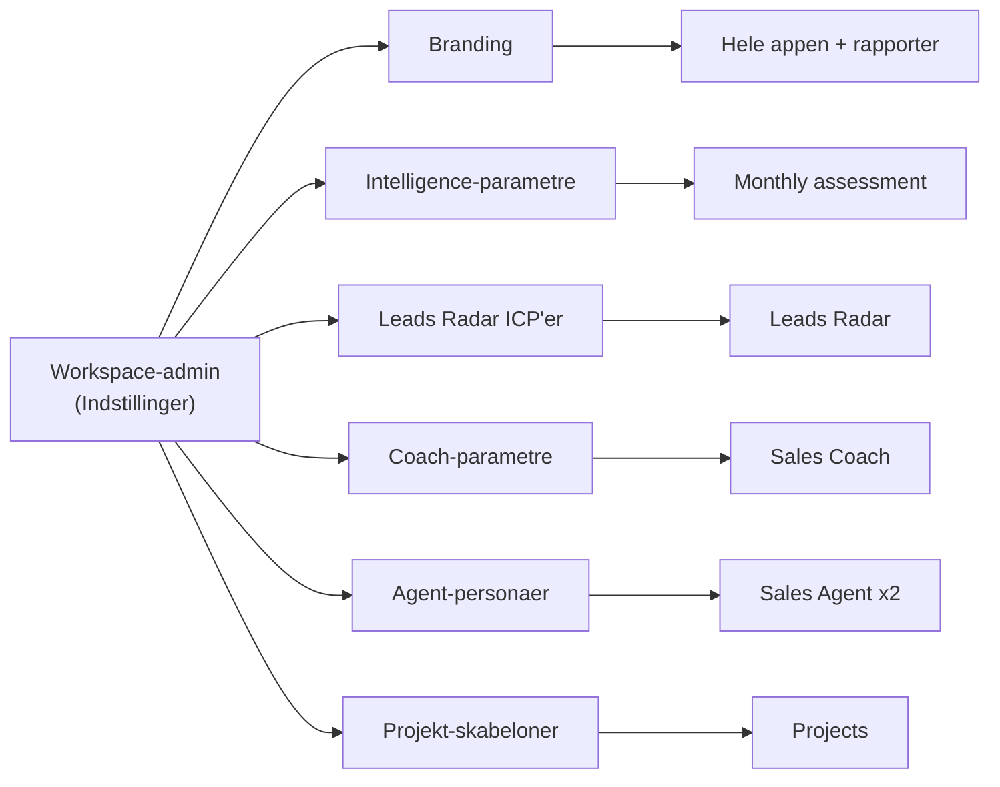

# 07 — Customization & settings pr. virksomhed

Dette dokument besvarer netop de spørgsmål, der var underbelyst: hvordan **hver virksomhed selv** sætter platformen op — intelligence-parametre, hvilke industrier/kunder Leads Radar leder efter, hvordan PhD/food scientists vedligeholder RAG, coach-parametre, branding (også af intelligence-rapporten), inbox som konkurrent-intelligence, customization af de to Sales Agents, og projekters indhold + vedhæftninger.

Princippet: **alt konfigureres pr. workspace** (multi-tenant). En `admin` i et workspace styrer indstillingerne; en `rep` arver dem. Tabellerne ligger i `03b_SCHEMA_ADDENDUM.sql`.

---

## 1. Market Intelligence — virksomheden sætter selv parametre (`intel_config`)

Hvert workspace definerer **hvad** der scannes og **hvordan** rapporten ser ud:

- **Competitor-univers:** liste af konkurrenter (navn, segment, land, prioritet) — redigerbar i UI. Chromologics' liste (Phytolon, Michroma, Debut, Oterra …) bliver bare default-data, ikke hardkodet.
- **Priority set:** hvilke der får dyb månedlig dækning (resten roterer).
- **Kategorier:** competitor / market / regulatory / ip — slå til/fra.
- **Target-produkter:** hvad man vil erstatte/overvåge (Chromologics: carmine, Red 3, Red 40, betanin) — et andet firma sætter sine egne.
- **Regioner & kilder:** geografisk fokus + foretrukne kilde-domæner.
- **Prompt-overrides:** workspace-specifikke instruktioner til scan-agenten.
- **Rapport-skabelon:** vælg layout/branding for den månedlige rapport (se §5).

**Settings-side:** `/app/settings/intelligence`. Scan-agenten læser `intel_config` ved hver kørsel i stedet for en fast prompt.

---

## 2. Leads Radar — hvilke industrier & kunder den leder efter (`radar_icps`)

I stedet for én fast søgning definerer virksomheden **flere "Ideal Customer Profiles" (ICP'er)** — fx "Nordiske drikkevareproducenter" og "EU-slik med Red 40-eksponering". Hver ICP:

- **account_kinds:** distributør / ingrediensproducent / brand-producent.
- **industries:** NACE-koder / brancher.
- **territories + maturity:** fx kun Norden, eller globale etablerede distributører.
- **signal_types:** funding, reformulering, lancering, regulatorisk, hiring, ekspansion.
- **keywords / exclude_keywords:** styr præcist hvad der tæller med.
- **min_fit_score + scoring_weights:** tærskel + hvordan fit beregnes (se §10).

Den daglige `radar-scan` kører hver aktiv ICP, scorer fund mod netop den profil, og foreslår pitch ud fra hvilken ICP der matchede. **Settings-side:** `/app/settings/radar` — opret/redigér ICP'er, se hvor mange leads hver giver.

---

## 3. RAG vedligeholdes & forbedres af food scientists / PhD (`knowledge_contributions`)

Dette var et vigtigt hul. Vidensbasen skal aktivt **kurateres af eksperterne**, ikke kun fyldes op én gang.

**To veje ind:**
1. **Direkte upload/curation:** en food scientist uploader food trials, retter en forældet spec, eller godkender et auto-genereret won-case-udkast. `documents.status` + review-flow.
2. **Anmodninger med interview-links:** systemet (eller en sælger) kan oprette en *contribution request* til en medarbejder — fx "Vi mangler stabilitetsdata for høj-protein-applikationer". Medarbejderen får et **link** (`knowledge_contributions.interview_link`) hvor de enten skriver svaret eller **optager et kort interview** (lyd/video → transskriberes → bliver til et RAG-dokument). Status: requested → in_progress → submitted → approved.

**Forbedrings-loop:** når Sales Agent ofte rammer "intet sikkert svar" på et emne (se dok. 08 om RAG-grounding), foreslår systemet automatisk en contribution request til den rette ekspert — så vidensbasen lukker sine egne huller. Feedback (tommel op/ned på svar) i `rag_feedback` peger på hvilke dokumenter der trænger til forbedring.

**Roller:** marketing/commercial leaders uploader værdimateriale (route = commercial); teknikere/PhD uploader trials/specs (route = technical). **Side:** `/app/knowledge` (bibliotek + bidrag + anmodninger).

---

## 4. Sales Coach — parametre der varierer fra firma til firma (`coach_config`)

Coach-metrics er ikke universelle. Hvert workspace definerer sine egne i `coach_config.metrics`:

- **Hvilke metrics måles** (talk/listen, åbne spørgsmål, indvendings-håndtering, monolog-længde, næste skridt … + egne).
- **Mål-værdier (`target`) og retning** (højere/lavere er bedre).
- **Vægte (`weight`)** der bestemmer hvordan den samlede coach-score beregnes.
- **Sprog** for coaching-feedback.

Sådan kan ét firma vægte discovery-dybde højt, mens et andet prioriterer korte, præcise tekniske svar. **Side:** `/app/settings/coach` — træk i mål og vægte, se effekten på score-beregningen.

---

## 5. Branding & white-label — også intelligence-rapporten (`workspace_settings`)

Hele platformen tilpasses virksomhedens identitet:

- **Logo, brand-farver, firmanavn, produktnavn** → driver app-tema OG den månedlige intelligence-rapport (header, farver, footer, kontakt).
- **Rapport-skabelon:** den eksisterende Chromologics-rapport bliver én skabelon; andre workspaces får deres eget look.
- **Feature-flags:** slå moduler til/fra pr. workspace (fx et firma uden voice).

Dvs. Market Intelligence-rapporten genereres med workspace'ets `report_header` + `brand_colors`, så den ser ud som *deres* rapport — ikke en generisk. **Side:** `/app/settings/branding`.

> Designsystemet (dok. 06, punkt 13) skal bygge med disse tokens som variabler, så branding slår igennem alle steder.

---

## 6. Inbox & kunde-emails som intelligence — især incumbent solutions (`competitor_mentions`)

Email er en undervurderet efterretningskilde. Når mails analyseres (fase 5), udtrækkes ikke kun resuméer, men også **konkurrent- og incumbent-signaler**:

- Nævner kunden at de bruger **carmine, en Oterra-blend, et Red 40-produkt** osv.? → `competitor_mentions` (source = email) med incumbent-løsning, kontekst, kobling til konto/projekt.
- Produkttest-resultater i en mail → forslag om at gemme som `food_trial`-dokument i RAG.
- Markeds-/konkurrent-omtaler → kan **promoveres til Monthly assessment** (`promoted_to_intel`) som input til månedens storylines.

Det giver to ting: (1) sælgeren ser hvilken incumbent de skal slå i netop denne deal, og (2) ledelsen får bottom-up signaler fra marken ind i intelligence-rapporten. Samme udtræk gælder for opkald (Sales Agent). Alt med menneskelig godkendelse før det påvirker delte data.

---

## 7. Customization af de to Sales Agents (`agent_configs`)

De to coaches (teknisk + commercial) er konfigurerbare pr. workspace:

- **Persona & display-navn:** fx "PhD food scientist" / "Commercial strateg".
- **System-prompt & tone:** hvor formel/kortfattet, hvilke regler (fx "svar altid med kilde og et tal").
- **Routing-keywords:** hjælper klassifikationen med at sende det rigtige spørgsmål til den rigtige agent — virksomheden kan tune det til sit eget sprogbrug.
- **Enabled:** et firma kan køre kun den tekniske, eller tilføje flere agent-typer senere (enum kan udvides).

Routing-flow: indkommende ytring → klassifikation (bruger `routing_keywords` + model) → vælg agent → agentens `system_prompt` + RAG-route (technical/commercial) → svar med kilder. **Side:** `/app/settings/agents`. Ændringer kan testes i en "prøv agenten"-sandbox før de går live.

---

## 8. Hvad et projekt indeholder — og hvordan det customizes (`project_templates`)

Et projekt er ikke fast. En **projekt-skabelon** pr. workspace (evt. pr. kundetype) definerer:

- **Faser & gates:** de 4 faser er standard, men `phase_config` bestemmer hvilke artefakter/checklister hver fase kræver (et distributør-forløb ser anderledes ud end et brand-forløb).
- **Custom felter:** `custom_fields` = virksomhedens egne felter (fx "applikationsvolumen", "regulatorisk marked", "incumbent farve"), med type og om de er påkrævede. Værdier gemmes i `projects.custom`.
- **Default-skabelon** vælges automatisk efter `account_kind`.

Et projekt indeholder derfor som minimum: konto + kontaktpersoner, application, produkt, fase/status, værdi, pitch-angle, tidslinje (`activities`), opgaver, møder, kald, **vedhæftninger** (§9), gate-artefakter, custom felter, og won/lost-årsag. **Side:** `/app/settings/project-templates`.

---

## 9. Vedhæftninger på projekter (og mere) (`attachments`)

Generisk vedhæftnings-system: filer kan hænges på **projekter, konti, kontakter, aktiviteter og kald**.

- Gemmes i en **Supabase Storage-bucket** med RLS (samme synlighed som det de hænger på).
- Felter: filnavn, type, størrelse, hvem uploadede.
- **`index_to_rag`-flag:** en vedhæftning (fx et trial-PDF) kan med ét klik også indekseres i vidensbasen — så projekt-dokumentation automatisk styrker RAG.
- Understøtter PDF/Word/Excel/billeder (kræver fil-ingestion fra dok. 06, punkt 3).

På projektets detaljeside vises en "Filer"-fane med upload + preview.

---

## 10. Fit-score gøres gennemsigtig

Fit-score (Leads Radar) beregnes ud fra den matchende ICP's `scoring_weights` — fx: signal-styrke, branche-match, territorie-match, incumbent-eksponering (bruger de carmine/Red 40?), størrelse/modenhed. Scoren vises altid **med en forklaring** ("88 — vegansk lancering + lav-pH applikation + carmine i dag"), så sælgeren forstår hvorfor.

---

## Hvad mangler vi ellers at tænke over? (åbne punkter)

Ud over ovenstående og Top 20 (dok. 06), er disse værd at beslutte tidligt:

1. **Onboarding af et nyt workspace:** en guidet opsætning (branding → competitors → ICP'er → coach-mål → inviter team → upload første viden), så et nyt firma kommer i gang uden konsulent.
2. **Skabelon-bibliotek på tværs:** standard-ICP'er, coach-profiler og outreach-flows man kan starte fra (branchespecifikke presets).
3. **Approval-flows:** hvem godkender at en email-insight bliver til delt intel, eller at et auto-won-case publiceres? (4-øjne-princip på delt data.)
4. **Versionering af viden:** når en spec opdateres, skal gamle svar kunne spores; behold historik på dokumenter.
5. **Sprog/lokalisering:** dansk + engelsk indhold og UI; territorie-specifikt sprog i outreach.
6. **Datadeling mellem distributør og slut-kunde-deals:** når en distributør (fx Brenntag) dækker mange brands/territorier — hvordan ruller pipeline op på koncern-niveau (delvist dækket af `parent_account_id`, men rapportering mangler).
7. **Rettighedsstyring for delte ressourcer:** RAG-viden er delt i workspace'et — skal noget viden være team-/rolle-begrænset (fx prissætning kun for commercial)?
8. **Sletning & dataejerskab pr. kunde** (multi-tenant): når en kunde stopper, skal hele deres workspace kunne eksporteres + slettes rent (GDPR, dok. 06 punkt 4).
9. **Audit & sporbarhed på AI-svar:** gem hvilken model/prompt/kilder der gav et svar (vigtigt når en sælger har sagt noget til en kunde baseret på agenten).
10. **Mål for succes pr. workspace:** lad virksomheden sætte egne KPI'er (win-rate, pipeline-hastighed) som ledelses-dashboardet (dok. 06 punkt 17) måler op imod.

Disse er ikke alle kritiske nu, men bør stå på listen, så de ikke "opdages" sent. De vigtigste at afklare før rigtig kundebrug er #3, #7 og #8 (alt sammen sikkerhed/governance).
