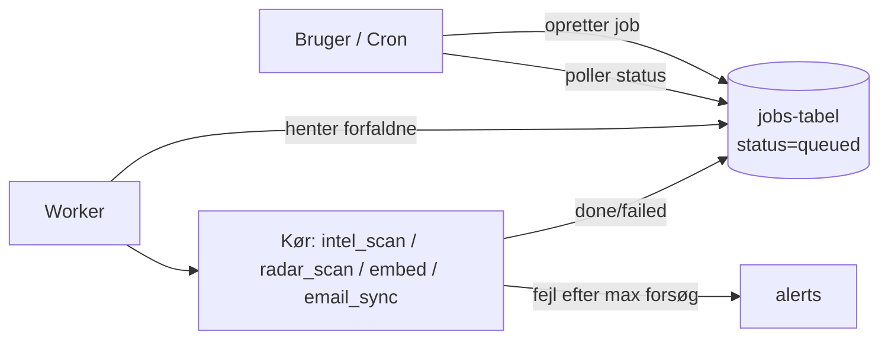
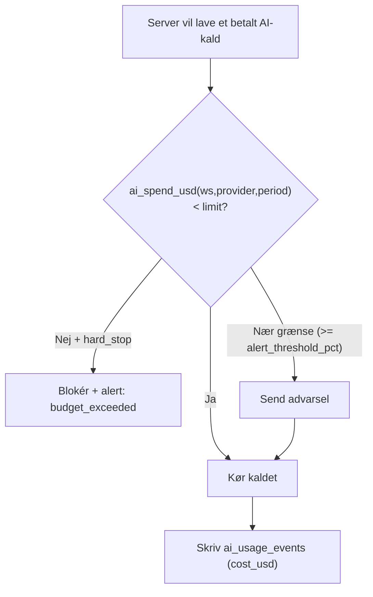
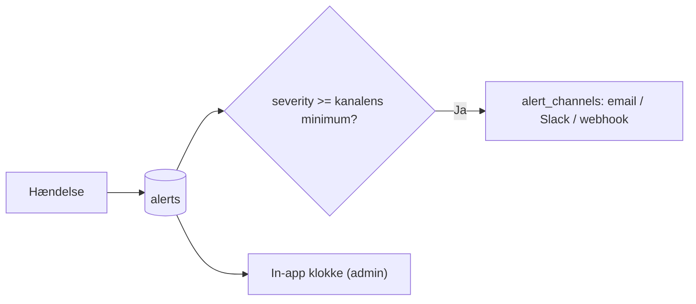
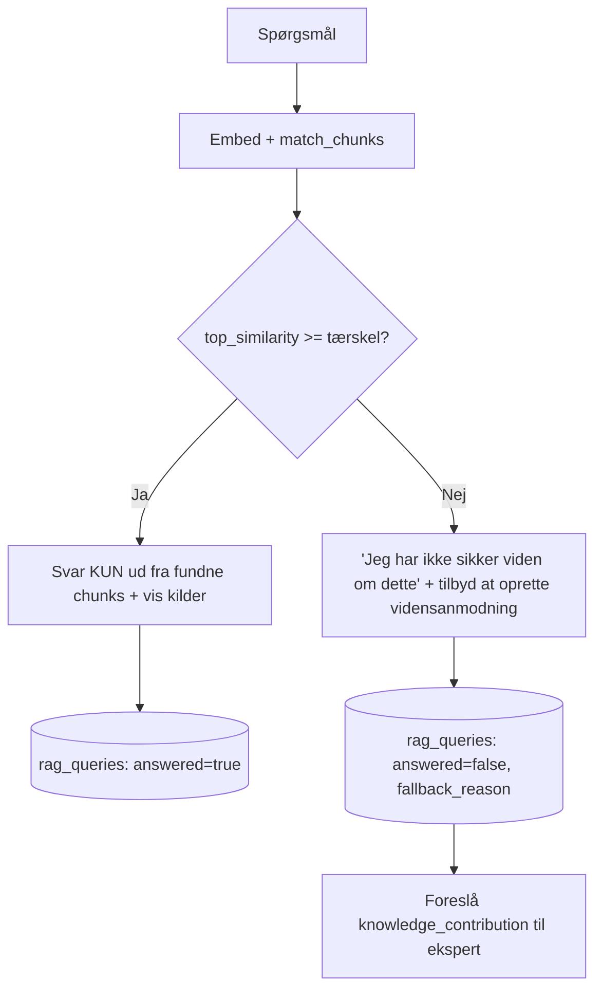

# 08 — Platform-drift: jobkø, budgetlofter, overvågning & RAG-grounding

De fire driftsting du bad om implementeret, specificeret konkret så Claude Code kan bygge dem. Tabellerne ligger i `03b_SCHEMA_ADDENDUM.sql`. Disse fire trækkes **frem** i køreplanen (se §5) fordi de påvirker alt det andet.

---

## 1. Jobkø — så tunge ting kan køre uden at fejle

**Problem:** Intelligence-scan, leads-scan, embeddings og email-sync tager minutter (web-søgning + AI). En almindelig webfunktion på Vercel stopper efter sekunder → jobbet fejler. Det rammer endda demo-funktionen "kør månedlig scan".

**Løsning:** Al langvarig/asynkront arbejde lægges i en kø og udføres af en worker. Webfunktioner *starter* kun jobbet og viser status.

**To muligheder — vælg én:**
- **A (anbefalet til hastighed):** en hostet jobtjeneste — **Inngest** eller **Trigger.dev** — som håndterer retries, timeouts, scheduling og logging out of the box. Mindst kode, mest robust.
- **B (færre afhængigheder):** den indbyggede `jobs`-tabel + en worker som **Supabase Edge Function** kaldt af `pg_cron`/Vercel Cron hvert minut, der tager `status='queued'` og kører dem (med `max_attempts`, exponential backoff).

**Regler:**
- Jobtyper: `intel_scan`, `radar_scan`, `embed_document`, `email_sync`, `coach_rollup`, `outreach_send`.
- Hvert job har `workspace_id`, `payload`, `attempts/max_attempts`, `scheduled_at`.
- Fejl efter `max_attempts` → opret en `alert` (kind=`job_failed`).
- UI viser jobstatus (fx "Scan kører… ~2 min"), så brugeren ikke venter på en hængende side.

**Sig til Claude Code:** *"Implementér jobkøen fra docs/08_PLATFORM_OPS.md (vælg Inngest, ellers jobs-tabel + Edge Function worker). Flyt intel_scan, radar_scan, embeddings, email_sync og outreach_send over i køen. Webfunktioner må kun oprette job + vise status."*

---

## 2. Administrativt AI-budgetloft pr. virksomhed

**Problem:** Tavily, OpenAI, Claude og Deepgram koster pr. brug. Uden lofter kan et løbsk job eller en travl kunde brænde mange penge — og i multi-tenant skal *hver kunde* kunne styres for sig.

**Løsning:** Budgetter administreres pr. workspace (og pr. udbyder/periode) i `ai_budgets`, alt forbrug logges i `ai_usage_events`, og **hver betalt AI-kald tjekkes mod budgettet før det udføres.**

**Administration (to niveauer):**
- **Platform-admin (jer som udbyder):** sætter standard-budget pr. kunde/plan, kan se forbrug på tværs af alle workspaces. (Bygges som en intern admin-visning; data findes allerede via `ai_usage_events`.)
- **Workspace-admin (kunden selv):** ser eget forbrug pr. modul/udbyder, kan sætte/justere egne lofter (inden for jeres maksimum), og får advarsel ved 80%.

**Felter:** `ai_budgets(provider, period [daily/monthly], limit_usd, hard_stop, alert_threshold_pct)`. Helper-funktionen `ai_spend_usd()` (i 03b) giver forbruget i indeværende periode.

**Indtænkt i kunde-administrationen:** budget-loftet er en del af workspace-opsætningen (`/app/settings/usage` for kunden; intern `/admin/workspaces` for jer). Når en plan oprettes, sættes default-budget automatisk.

**Sig til Claude Code:** *"Implementér AI-budgetlofter pr. workspace fra docs/08. Log alle betalte AI-kald i ai_usage_events med cost_usd. Før hvert kald: tjek ai_spend_usd mod ai_budgets; blokér ved hard_stop-overskridelse og rejs en alert; advar ved alert_threshold_pct. Byg en forbrugs-/budget-side for workspace-admin og en intern admin-oversigt på tværs af workspaces."*

---

## 3. Overvågning & alarmer

**Problem:** Hvis et cron-job fejler, en integration er nede, eller et budget rammes — det skal opdages **med det samme**, ikke ved næste demo.

**Løsning, to lag:**
1. **Teknisk overvågning (kode-fejl):** **Sentry** på frontend + alle baggrundsjobs. Fanger crashes og fejlrater.
2. **Drifts-alarmer (forretningshændelser):** `alerts`-tabellen + `alert_channels`. Hændelser der rejser en alert:
   - `job_failed` — et job fejlede efter max forsøg.
   - `budget_exceeded` / `budget_warning` — AI-forbrug.
   - `integration_down` — Google/Tavily/embedding-tjeneste svarer ikke.
   - `intel_scan_empty` — månedsscan gav intet (mulig fejl).
   - `oauth_revoked` — en bruger mistede Google-adgang.

- **Kanaler:** email + Slack (webhook). Pr. workspace, med `min_severity`.
- **In-app:** admin ser åbne alerts med ack/resolve.
- **Sundhedstjek:** et lille periodisk job pinger integrationer og skriver `integration_down` hvis noget er galt.

**Sig til Claude Code:** *"Sæt Sentry op for frontend + jobs. Implementér alerts + alert_channels fra docs/08: rejs alerts for job_failed, budget_exceeded/warning, integration_down, intel_scan_empty og oauth_revoked, og send dem til email/Slack pr. workspace-konfiguration. Vis åbne alerts for admin med ack/resolve."*

---

## 4. RAG der ved hvornår den IKKE ved noget

**Problem:** En sælger der får et **opfundet** pH-tal eller en fri-opfundet reference på et kundeopkald er farligere end intet svar. RAG må aldrig gætte.

**Løsning:** Et **similarity-gate** + ærlig fallback + logging + forbedrings-loop.

**Regler:**
- **Tærskel pr. workspace:** `workspace_settings.features.rag_min_similarity` (default 0.78). Under den → "intet sikkert svar".
- **Grounding i prompten:** agenten instrueres eksplicit: *svar kun ud fra de medsendte kilder; hvis de ikke dækker spørgsmålet, sig det ærligt — opfind ALDRIG tal, specs eller referencer.*
- **Citation-krav:** hvert svar viser de kilder det bygger på (doc-titel + type). Intet svar uden kilde.
- **Logging:** alle opslag i `rag_queries` (top_similarity, answered, fallback_reason, latency). Tommel op/ned i `rag_feedback`.
- **Forbedrings-loop:** når et emne ofte rammer fallback, foreslår systemet en `knowledge_contribution` til den rette food scientist/PhD (jf. dok. 07 §3) — så hullet lukkes.
- **Eval:** `rag_eval_cases` (spørgsmål + forventet) køres jævnligt så vi måler om kvaliteten stiger over tid.

**Sig til Claude Code:** *"Implementér RAG-grounding fra docs/08: tilføj et similarity-gate (workspace_settings.features.rag_min_similarity, default 0.78), tving svar til kun at bruge fundne kilder og sige 'intet sikkert svar' ellers, log alle opslag i rag_queries, tilføj tommel op/ned (rag_feedback), og foreslå en knowledge_contribution når et emne ofte fejler. Lav en lille rag_eval-kørsel."*

---

## 5. Hvor i køreplanen disse hører hjemme

Opdatér `04_BUILD_ROADMAP.md` så disse trækkes frem:

| Driftsting | Fase | Hvorfor der |
|---|---|---|
| **Jobkø** | **Fase 0/1** | Intel-scan (demo 23/6) skal køre i kø, ellers timeout. Byg minimal kø i fase 0–1. |
| **RAG-grounding** | **Fase 3** | Bygges sammen med selve RAG'en — gate + fallback fra dag ét. |
| **AI-budgetlofter** | **Fase 3–4** | Så snart der er rigtige AI-kald i drift (RAG, radar). |
| **Overvågning/alarmer** | **Fase 4–5** | Når cron-jobs og integrationer kører fast; udbyg løbende. |
| **Customization/settings (dok. 07)** | gradvist | Hver modul-fase bygger sin egen settings-side (intel i fase 1, radar/agent i fase 3–4, branding tidligt). |

**Anbefaling:** indfør den **minimale jobkø allerede i fase 0**, og RAG-grounding som en fast del af fase 3. Budget + overvågning kan starte simpelt (loft + email-alarm) og udbygges.

---

## 6. Acceptkriterier (porte for disse fire)

- [ ] Et langt job (intel-scan) kører i kø til ende uden timeout; status vises i UI; fejl rejser en alert.
- [ ] Et workspace kan ikke overskride sit AI-budget (hard_stop blokerer); admin ser forbrug; advarsel ved 80%.
- [ ] En fremtvunget fejl (fx slå en integration fra) udløser en alert til email/Slack.
- [ ] Sales Agent svarer "intet sikkert svar" når der ikke er dækning — og opfinder aldrig tal; alle svar har kilder; opslag logges.
